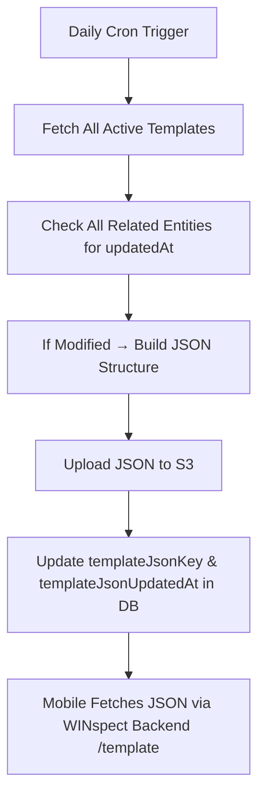
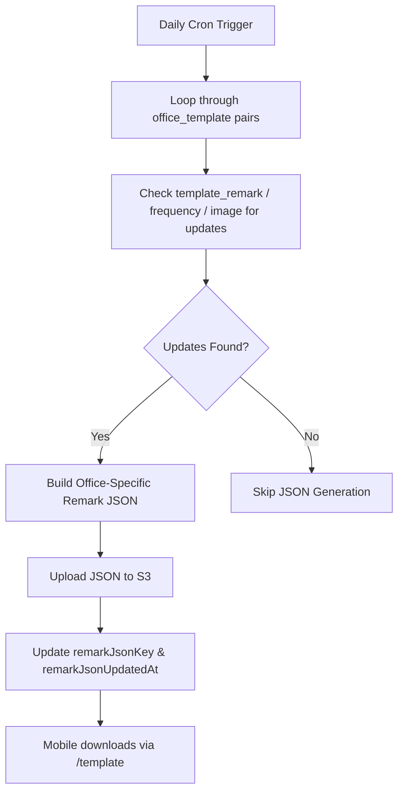
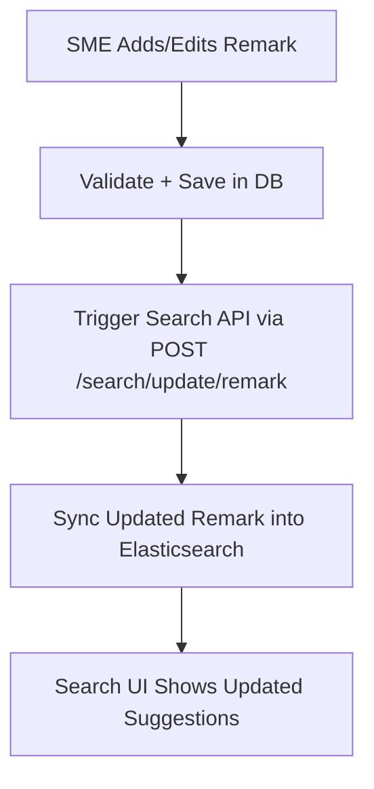
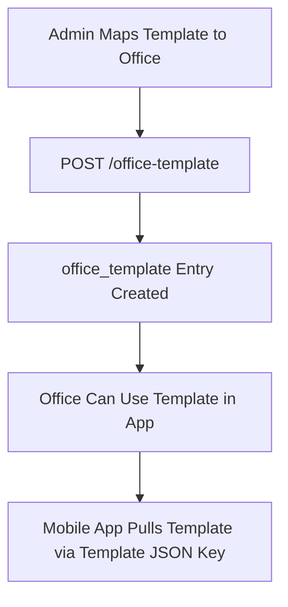

# WINspect SME Toolkit – Backend Documentation

The WINspect SME Toolkit backend powers all administrative and template-level configurations across the WINspect platform. It is the **source of truth** for template structures, category mappings, office-service access, and syncing these changes with downstream systems like mobile offline support.

---

## 📦 Repository Overview

**Repo:** [WINspect_SME_toolkit_backend](https://github.com/WIN-Services/WINspect_SME_toolkit_backend.git)

**Swagger Docs:** [https://preprod-api.winspectdev.com/sme-api-docs](https://preprod-api.winspectdev.com/sme-api-docs)

**Purpose:**
- Manage report templates, categories, subcategories
- Insert/edit/hide/assign remarks across offices
- Generate JSON structures used for offline sync
- Push updates to Elasticsearch (search service)
- Gate office access to templates

---

## ⚙️ Tech Stack

- Node.js (Express)
- mySQL via Sequelize ORM
- AWS S3 for template/remark JSON
- Cron jobs for daily JSON generation
- Integrated with:
  - [WINspect Backend](https://github.com/WIN-Services/WINspect_backend.git)
  - [WINspect Offline Sync](https://github.com/WIN-Services/WINspect_offline_sync.git)
  - [WINspect Search Service](https://github.com/WIN-Services/winspect-search-flask.git)

---

## 🔧 Setup & Configuration

```bash
git clone https://github.com/WIN-Services/WINspect_SME_toolkit_backend.git
cd WINspect_SME_toolkit_backend
npm install
cp .env.example .env
npm run dev
```

The service is deployed on **ECS (Fargate)**.

---

## 🧱 Core Responsibilities

| Area             | Description                                                                 |
|------------------|-----------------------------------------------------------------------------|
| Templates        | Define and manage templates, categories, and subcategories                  |
| Remarks          | Manage remarks, frequency/action, visibility across offices                 |
| Office Access    | Assign template access and services to offices                              |
| JSON Generation  | Cron-based job to publish static JSONs for mobile clients                   |
| Search Sync      | Push updated remarks and actions to Elasticsearch for UI search             |

---
## 🔁 API Responsibilities

All endpoints are secured via JWT middleware and some require SME role access. For Swagger UI documentation, visit:

📄 **Swagger Docs:** [https://preprod-api.winspectdev.com/sme/api-docs](https://preprod-api.winspectdev.com/sme/api-docs)

This section lists all SME Toolkit backend APIs grouped by core functional areas.

---

### 🧩 Template

| Method | Endpoint | Description |
|--------|----------|-------------|
| `GET`  | `/template` | Fetch all templates |
| `POST` | `/template` | Create a new template |
| `PUT`  | `/template` | Update template info (icon, name, version) |
| `PUT`  | `/template/structure` | Modify template structure including category-subcategory |
| `PUT`  | `/template/icon` | Update icon image for a template |
| `PUT`  | `/template/category/order` | Reorder template categories |
| `PUT`  | `/template/subcategory/order` | Reorder subcategories within a category |
| `GET`  | `/template/category` | Get categories under a template |
| `GET`  | `/template/subcategory` | Get subcategories under a template |
| `POST` | `/template/definition` | Add/edit disclosure or definitions |
| `POST` | `/template/location` | Add/edit template location data |
| `GET`  | `/template/location` | Get all locations for a template |

---

### 🗂️ Remark

| Method | Endpoint | Description |
|--------|----------|-------------|
| `GET`  | `/template-remark` | List all template remarks |
| `GET`  | `/template-remark/group` | Fetch remarks grouped by category |
| `POST` | `/template-remark` | Add a new template remark |
| `PUT`  | `/template-remark/update` | Update remark title, content |
| `DELETE`| `/template-remark` | Soft-delete a remark |
| `PUT`  | `/template-remark/status` | Hide/unhide remark from structure |
| `PUT`  | `/template-remark/frequency/bulk` | Update frequency/action for multiple remarks |
| `PUT`  | `/template-remark/es-sync` | Push single remark update to search (Elasticsearch) |
| `POST` | `/template-remark/custom/bulk` | Add multiple office-specific custom remarks |
| `POST` | `/template-remark/custom` | Add multiple default remarks |

---

### 🏢 Office & Access Control

| Method | Endpoint | Description |
|--------|----------|-------------|
| `GET`  | `/office-template` | List templates available to an office |
| `POST` | `/office-template` | Assign template to office |
| `PUT`  | `/office-template` | Update office access to template (enable/disable) |
| `GET`  | `/office-service` | List services assigned to offices |
| `POST` | `/office-service` | Assign service to an office |
| `PUT`  | `/office-service` | Update service access for office |

---

### 📤 Elasticsearch Sync

| Method | Endpoint | Description |
|--------|----------|-------------|
| `POST` | `/remark/search/sync` | Bulk sync remarks to search index |
| `PUT`  | `/template-remark/es-sync` | Push updated remark to search (used during edit) |

---

### 📦 Offline JSON Management

| Method | Endpoint | Description |
|--------|----------|-------------|
| `GET`  | `/template/json` | Return S3 path and version info of static template JSON |
| `GET`  | `/remark/json` | Return S3 path for office-specific remark JSON |
| `POST` | `/remark/json/sync` | Manually trigger remark JSON regeneration for office (admin only) |
| `POST` | `/template/json/sync` | Manually regenerate full template JSON structure |

---

### 🧪 About, reminder, disclosure

| Method | Endpoint | Description |
|--------|----------|-------------|
| `GET`  | `/template/about` | Get template about values |
| `POST` | `/template/about` | Add/edit about content |
| `PUT`  | `/template/about/note` | Add/edit notes to about value |
| `GET`  | `/template/subcategory/reminder` | Get subcategory reminders |
| `POST` | `/template/subcategory/reminder` | Add/edit reminder |
| `GET`  | `/template/disclosure` | Get disclosure info |
| `POST` | `/template/disclosure` | Create or update disclosure |


---

## ⏱️ Cron Jobs (Defined in SME Toolkit)

Runs via ECS scheduled task or CloudWatch Events:

### 🔄 Template JSON Generator

- Runs daily
- Queries `template`, `template_category`, `template_subcategory`, `template_definition`, etc.
- If `updatedAt` is newer than stored `templateJsonUpdatedAt`
  - Generates template structure JSON
  - Uploads to S3
  - Updates `templateJsonKey` in DB

### 🧠 Remark JSON Generator

- Iterates through each `office_template` entry
- If changes are found in `template_remark`, `template_remark_frequency`, or `template_remark_image`
  - Generates office-specific JSON
  - Uploads to S3
  - Updates `remarkJsonKey` and `remarkJsonUpdatedAt` in DB

---

## 🔗 Integrations

### ✅ Elasticsearch (Search Service)

- All updates to `template_remark` are synced with the search service using:
  - `POST /search/update/remark`

### ✅ WINspect Backend & Offline Sync

- When a report is started, structure is pulled from SME definitions.
- Mobile clients rely on:
  - Static JSON: Downloaded once (if fresh or older than 5 days)
  - Delta Sync: Pulled via WINspect Offline Sync service

---

## 🛑 Not In Scope

This service does **not**:

- Handle report creation
- Persist report data
- Upload or process user images
- Manage JWT/session/auth for report writer clients
- Generate PDFs

---

## ✅ Sample Workflow

| Action                         | Triggered From     | Result                                                   |
|--------------------------------|--------------------|-----------------------------------------------------------|
| SME creates template           | Admin UI           | Structure saved → JSON generated next cron                |
| Remark edited for frequency    | SME UI / WINspect  | Frequency saved → synced to search + updated in DB        |
| Office gets new service        | Admin UI           | `office_template` updated → reflected in report flow      |
| Inspector syncs data offline   | Mobile App         | JSONs served → remarks available in offline mode          |

---

## 📂 Folder Structure

```
WINspect_SME_toolkit_backend/
├── controllers/                  # All route handlers
│   ├── architectural_type.js
│   ├── auth.js
│   ├── office.js
│   ├── service.js
│   ├── template.js
│   ├── template_about.js
│   ├── template_about_value.js
│   ├── template_about_value_note.js
│   ├── template_category.js
│   ├── template_location.js
│   ├── template_remark.js
│   ├── template_subcategory.js
│   └── template_subcategory_reminder.js
│
├── routes/                       # Route-level definitions
│   ├── architectural_type.js
│   ├── auth.js
│   ├── index.js
│   ├── office.js
│   ├── service.js
│   ├── template.js
│   ├── template_about.js
│   ├── template_about_value.js
│   ├── template_about_value_note.js
│   ├── template_category.js
│   ├── template_location.js
│   ├── template_remark.js
│   ├── template_subcategory.js
│   └── template_subcategory_reminder.js
│
├── services/                     # Business logic layer
│   ├── architectural_type.js
│   ├── auth.js
│   ├── elasticsearchService.js
│   ├── office.js
│   ├── service.js
│   ├── template.js
│   ├── template_about.js
│   ├── template_about_value.js
│   ├── template_about_value_note.js
│   ├── template_category.js
│   ├── template_location.js
│   ├── template_remark.js
│   ├── template_subcategory.js
│   └── template_subcategory_reminder.js
│
├── validations/                 # Joi validators
│   ├── architectural_type.js
│   ├── auth.js
│   ├── office.js
│   ├── service.js
│   ├── template.js
│   ├── template_about.js
│   ├── template_about_value.js
│   ├── template_about_value_note.js
│   ├── template_category.js
│   ├── template_location.js
│   ├── template_remark.js
│   ├── template_subcategory.js
│   └── template_subcategory_reminder.js
│
├── helpers/                     # Utility modules and integrations
│   ├── cron.js
│   ├── error.js
│   ├── externalApi/
│   │   └── search.js
│   ├── lambda.js
│   ├── loggers.js
│   ├── mailer.js
│   ├── messages.js
│   ├── migrations.js
│   ├── s3.js
│   └── utils.js
│
├── cron/                        # Daily JSON generation logic
│   ├── updateRemarkJson.js
│   └── updateTemplateJson.js
│
├── config/                      # DB, env, and server config
│   └── *.js
│
├── deployments/                # Infra as Code (staging, prod)
│   ├── deploy.sh
│   ├── infra_dev.py
│   ├── infra_staging.py
│   └── requirements.txt
│
├── models/                      # Sequelize models
├── middlewares/                # Auth, validation, logging middlewares
├── app.js                       # Express app definition
├── server.js                    # Server bootstrapping
├── .env.example
└── README.md

```

## 📊 Developer Diagrams

### 🧱 Template JSON Generation Flow



### 💬 Remark JSON Generation Flow (Per Office)



### 🔍 Remark Sync to Search Service



### 🏢 Office Access Management Flow



---


## 🔄 Search-to-RDS Sync Integration

The SME Toolkit backend ensures that any updates made to remarks—either via the **Web Remark Management Panel** or through **report submission**—are kept consistent across both Elasticsearch (used by the web search bar) and RDS (used for offline sync).

While Elasticsearch reflects these changes for real-time UI updates, the **search service** also makes internal calls to this backend to persist updates in the relational database. This guarantees that offline clients (e.g., mobile apps using WatermelonDB) receive the latest data during sync.

### 🔧 APIs Called by Search Service

| Method | Endpoint                                 | Description                                                    |
|--------|------------------------------------------|----------------------------------------------------------------|
| `POST` | `/template-remark/custom/bulk`           | Add multiple office-specific custom remarks                    |
| `POST` | `/template-remark/custom`                | Add multiple default remarks to the base template              |
| `PUT`  | `/template-remark/update`                | Update title and content of a remark                           |
| `PUT`  | `/template-remark/frequency/bulk`        | Bulk update frequency/action for multiple remarks              |

> ✅ This keeps Elasticsearch and RDS in sync, ensuring consistency between real-time UI and offline sync mechanisms.

---

## 🔗 Related Services

- [WINspect Backend](https://github.com/WIN-Services/WINspect_backend.git) – Fetches structure during report start or template sync
- [WINspect Offline Sync](https://github.com/WIN-Services/WINspect_offline_sync.git) – Cron jobs for regenerating and uploading JSON
- [WINspect Search Flask](https://github.com/WIN-Services/winspect-search-flask) – 	Elasticsearch sync used for report UI remark search

---
